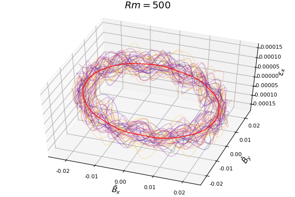
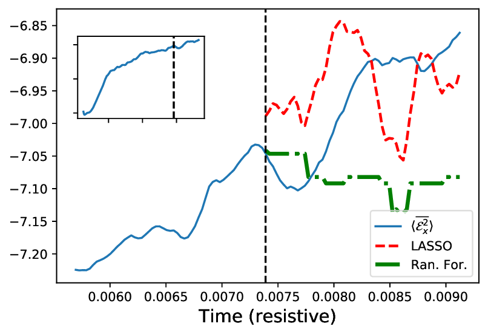

A short review of my recently published work with [Joonas Nättilä](http://natj.github.io/) where we used various machine learning algorithms to model dynamos: 
 - Paper: [arxiv.org/abs/1905.08193](https://arxiv.org/abs/1905.08193)
 - Code + data: [github.com/fnauman/ML_alpha2](https://github.com/fnauman/ML_alpha2)

## Introduction
Astrophysical flows are electrically neutral because the number of positive and negative charges on large scales is roughly equal. Magnetic fields are a different story since supernovae, high temperatures close to stars or gravitational friction close to supermassive black holes can ionize these flows. Earth's own [magnetic field](https://en.wikipedia.org/wiki/Earth%27s_magnetic_field) has a magnitude of about 0.5 Gauss and is extended up to 200 Earth radii on the magnetotail side. In comparison, the average magnetic field strength on the Sun is only twice as much (1 Gauss) but sunspots can have magnetic field strengths up to 4000 Gauss, and the solar magnetic field extends well beyond 1 AU (\\( 10^{11} \\) meters). If the Sun did not have a way to regenerate its field, it would have lost its magnetic field on Ohmic decay [time scale of a few thousand years](https://en.wikipedia.org/wiki/Dynamo_theory) (the Sun is 4.6 billion years old). Dynamo theory addresses this puzzle by introducing various mechanisms including fluid turbulence.

[Turbulence](https://en.wikipedia.org/wiki/Turbulence) can be defined as a state of high dimensional non-linear fluid motion. Broadly speaking, two types of turbulence approaches exist: [statistical](http://www.scholarpedia.org/article/Turbulence) and the [dynamical systems](http://chaosbook.org/chapters/PDEs.pdf). Most modeling is done using the statistical approach, particularly using [reduced order models](https://en.wikipedia.org/wiki/Turbulence_modeling) with tunable parameters. The fluid state in most astrophysical fluids is expected to be extremely nonlinear because of the high Reynolds number (large velocities, large length scales compared with low fluid viscosities due to low densities). Analytical models are incapable of modeling non-linear systems thus motivating the need for numerical simulations. 

Numerical simulations of astrophysical magnetic fields involve modeling the full magnetohydrodynamic (ionized fluids) equations. The data from such simulations is then modeled using a surrogate form:

$$
\partial_t \bar{B} = \nabla\times(\bar{V}\times \bar{B}) +  \nabla\times \mathcal{E} + \eta \nabla^2 \bar{B}
$$

where \\( \bar{V} \\) is the (background) velocity, \\( \bar{B} \\) is the magnetic field. The bar represents some sort of averaging, which could be spatial, temporal or ensemble. In a [flow driven dynamo](https://iopscience.iop.org/article/10.1088/1367-2630/9/8/309) with a fixed velocity (that is, one does not have to solve Navier Stokes to compute the velocity) the equation above describes the magnetic field evolution. All the terms in the above equation only depend on either the mean magnetic field, \\( \bar{B} \\) or the background velocity, \\( \bar{V} \\) (which is often ignored except in systems with shear) except the electromotive force:

$$
\mathcal{E} = \bar{v'\times b'}.
$$

Here the primed quantity represents the high pass filtered components. In this [kinematic approach](https://en.wikipedia.org/wiki/Dynamo_theory#Kinematic_dynamo_theory), the question of understanding magnetic field generation and sustenance thus reduces to a closure model for the **turbulent** electromotive force in terms of 'observables': mean fields.

[Traditional approaches](https://www.cambridge.org/core/journals/journal-of-plasma-physics/article/advances-in-meanfield-dynamo-theory-and-applications-to-astrophysical-turbulence/489FB860C46633C54D9F9B81E0BD7ABA) to computing the electromotive force have been mostly restricted to linear models of the type:

$$
\mathcal{E} = \alpha \bar{B} - \eta \nabla\times \bar{B} + ...
$$

where the various coefficients are computed using linear regression. Some work on non-linear models has been done especially in the context of [magnetic helicity](https://arxiv.org/abs/1402.0933) (for more references, please check out our paper). Once one determines the form the electromotive force in terms of the magnetic fields and its gradients, the closure problem is considered solved. 

## Our work

**Figure 1:** Each line represents the spatial profile of the fields at a particular instant in time. The thick red line is the time averaged spatial profile. As one can see, the fields are indeed quite organized spatially. The circular shape is expected because the forcing is isotropic (no shear, gravity, etc.) and we used planar (x-y) averaging (\\( \bar{B}_z = 0 \\)): magnetic energy = \\( \bar{B}_x^2 + \bar{B}_y^2 \\) = constant.

**Non-linear basis**: In addition to the linear basis used in most literature mentioned above, we also considered an order 3 polynomial basis:

$$
\bar{B}_x, \bar{B}_y, \bar{B}_x\bar{B}_y, \bar{B}^2_x, \bar{B}^2_y, \bar{B}^3_x, \bar{B}^3_x,...
$$

**Algorithms**:  We used linear, regularized linear and non-linear regression methods: **Lasso**, **Random Forests**, **Markov Chain Monte Carlo**. The motivation to use algorithms such as random forests is not just that they can model non-linearity. Even a linear algorithm with a non-linear basis can model non-linearity. But random forests offer several advantages as they: (i) can model interactions between different linear/non-linear terms;  (ii) are robust to outliers; and  being an ensemble average of many decision trees, (iii) reduce variance.

**Dataset**: The data comes from Direct Numerical Simulations (DNS) of the simplest non-linear dynamo model: helically forced magnetohydrodynamic turbulence (or alpha squared) using the [pencil code](https://github.com/pencil-code/pencil-code). This setup is known to lead to a saturated state where the large (box-scale) magnetic fields completely dominate the energy budget, and are typically organized as a single sinusoid owing to the periodic nature of the boundaries. Links to data are [here](https://github.com/fnauman/ML_alpha2).

**Figure 2:** Time series fits for the electromotive force, comparing the predictions from Lasso and Random Forest to the test data.

**Results**: We found that Lasso outperformed all other algorithms. It is because of the low-dimensional nature of our data. Most of the energy is stored in sinusoids in space, and the temporal profile follows a nice growth then saturation pattern that is easy to model. We considered non-linear models for the electromotive force as well and used ensembles of models to figure out the most important features. It turns out that the isotropic alpha model works best, that is:

$$
\mathcal{E}_x \sim \alpha \bar{B}_x, \qquad \mathcal{E}_y \sim \alpha \bar{B}_y
$$ 

but as we describe in the paper, this could be misleading as the alpha term here really represents the balance between the generation and dissipation due to currents. In other words, the current density (the curl of B) is highly correlated with the magnetic field so the algorithms are unable to differentiate between the contributions from different terms.

 The [principle of parsimony](https://www.ejwagenmakers.com/inpress/VandekerckhoveEtAlinpress.pdf): why use sophisticated machine learning algorithms to arrive at the conclusion that regularized linear regression is the best model? Previous work has almost exclusively used linear regression to find coefficients for mean field dynamo models. Our goal in this work is to demonstrate through a thorough comparison of various machine learning algorithms that for more robust modeling of plasma turbulence, it is better to do a comparison of various models instead of always assuming that linear regreession does the best job. In our case, we found that the data is highly organized (due to the helical forcing used).  This explains why *regularized* linear regression outperformed more sophisticated algorithms. For more sophisticated plasma turbulence, for example, systems with shear it is likely that linear regression is not going to do well. We are working on this case right now.
